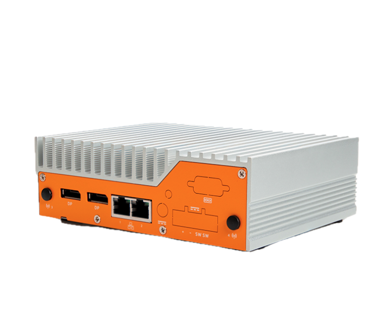
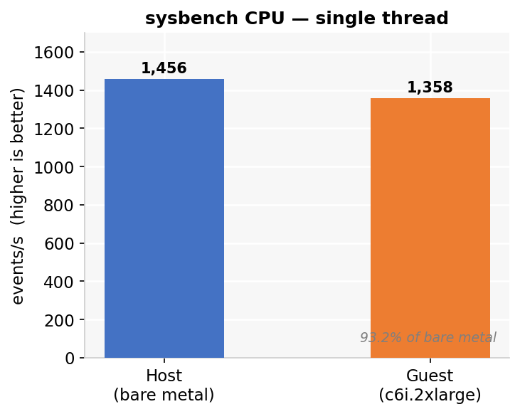
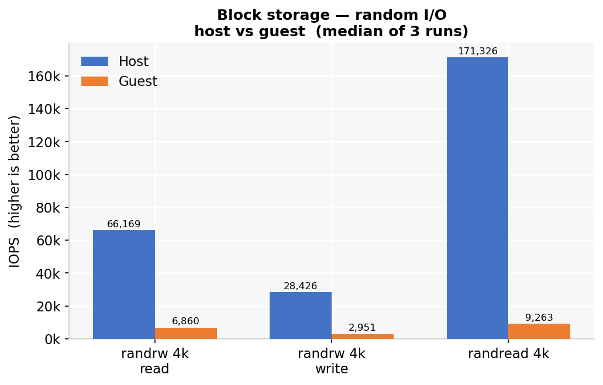
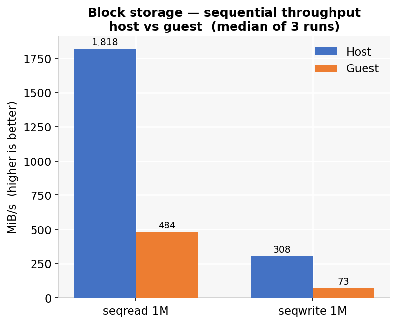
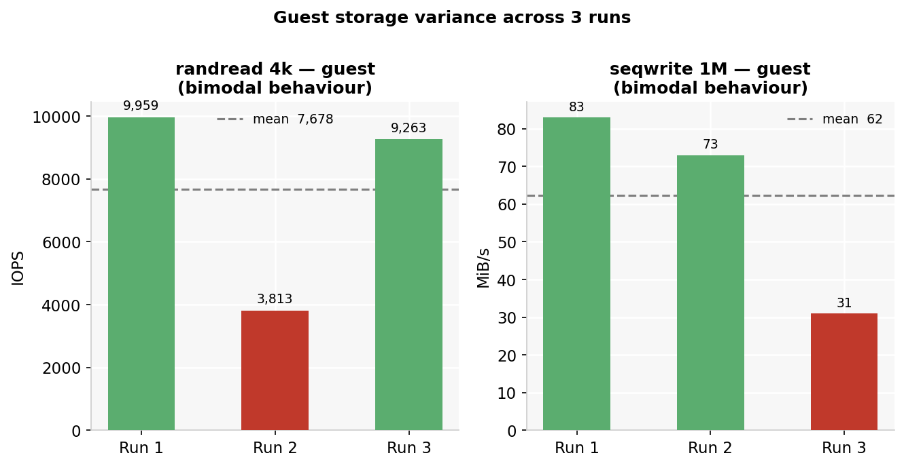
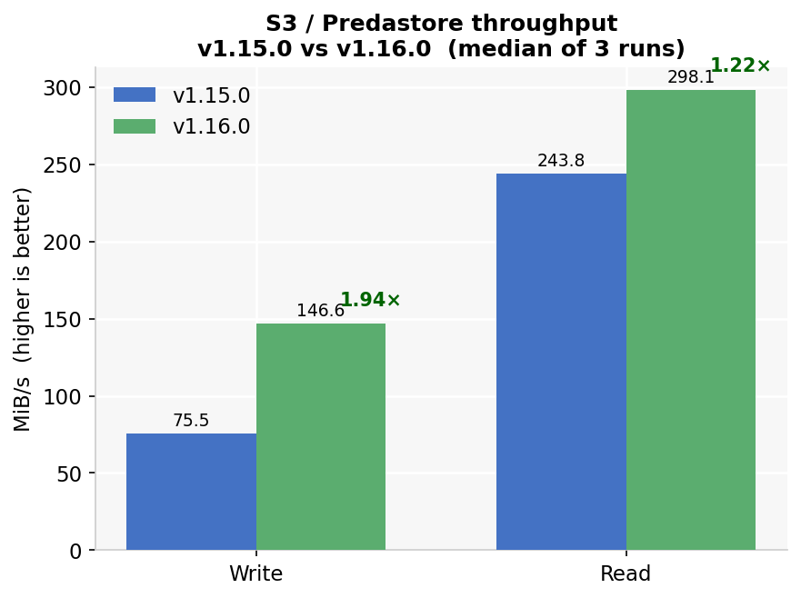

## Overview

The [OnLogic HX401](https://www.onlogic.com/hx401/) is a fanless, passive-cooled industrial edge computer that runs the complete Spinifex service set — EC2, EBS, S3 and VPC networking — in a form factor small enough to panel-mount inside a factory cabinet, attach to a DIN rail in a control room, or deploy unattended at a remote site without active cooling or rack infrastructure. Spinifex exposes EC2, EBS and S3-compatible APIs on the node, so the operational model is unchanged from AWS: use the `aws` CLI, SDKs, Terraform or OpenTofu, and CI/CD pipelines already used for cloud workloads. The change is the endpoint, not the workflow.

Single-node removes the distributed-storage guarantees of a multi-node cluster — Predastore runs RS(1,0) on one disk, so there is no erasure-coded redundancy. For edge deployments where data is generated locally, processed on-node, and shipped upstream on a schedule, or where the box provides compute capacity next to a sensor or control network rather than acting as a primary data store, this is the expected and appropriate configuration.

<p align="center"></p>

### Platform

| Component | Specification |
|---|---|
| **Bare-metal host** | [OnLogic HX401](https://www.onlogic.com/hx401/) — fanless, passive-cooled industrial edge computer |
| **CPU** | Intel i5-1250PE — 12 physical cores / 16 threads |
| **Memory** | 31 GiB |
| **Storage** | Transcend TS256GMTE652T2, 256 GB NVMe (PCIe Gen3 x4) |
| **Networking** | 2× Intel GbE (I210-IT + I219-LM) |
| **Host OS** | Debian 13 |
| **Guest OS** | Ubuntu 26.04 LTS |
| **Instance type** | `c6i.2xlarge` — 8 vCPU, 16 GiB |
| **Form factor** | Fanless, passive-cooled; DIN rail, wall and VESA mountable |

## Architecture

### AWS services exercised

| Service | Role |
|---|---|
| **EC2** | Guest instances on the host NVMe; no spread placement groups on a single node |
| **EBS (Viperblock)** | Local NVMe-backed block volumes per instance, surviving termination independently when `delete_on_termination = false` |
| **S3 (Predastore)** | RS(1,0) single-node object storage — no erasure-coding overhead, no distributed redundancy |
| **VPC (OVN)** | Standalone OVN northbound/southbound databases on the node itself |

## Prerequisites

- OnLogic HX401 (or comparable x86 node) running **Debian 13** or **Ubuntu 26.04 LTS**
- The WAN interface enslaved to a Linux bridge named `br-wan` — the host IP, default route and DHCP must live on the bridge, not the bare NIC
- A reserved range of addresses on your LAN for guest instances — this deployment uses `192.168.157.201-250`
- AWS CLI configured with `AWS_PROFILE=spinifex` pointing at the node's EC2-compatible endpoint (`https://<host>:9999`)

Verify the bridge before installing:

```bash
ip -br link show br-wan
ip route
```

## Instructions

### 1. Install Spinifex and verify the node

Follow the [Single-Node Install](/docs/install) guide, using `--nodes 1` to select the single-node templates — RS(1,0) storage and a single-member NATS cluster.

**Set a static external pool.** `init` auto-detects the external network and selects `source = "dhcp"` when the host holds a DHCP lease. That does not work for guests on every network: the upstream DHCP server answers the host on `br-wan` but does not necessarily offer addresses to guest ENI MAC addresses, causing instance launches to fail with:

```text
PrepareRunInstances: public IP allocation failed — aborting launch
dhcp DORA on br-wan: unable to receive an offer: context deadline exceeded
```

Edit `/etc/spinifex/spinifex.toml` to use a static range reserved for guests on your LAN:

```toml
[[network.external_pools]]
name        = "wan"
source      = "static"
range_start = "192.168.157.201"
range_end   = "192.168.157.250"
gateway     = "192.168.157.1"
prefix_len  = 24
dns_servers = ["1.1.1.1", "8.8.8.8"]
```

See the [VPC Networking](/docs/vpc-networking) guide for full configuration options. Then start the platform and confirm the node is ready:

```bash
sudo systemctl start spinifex.target
sudo spx get nodes
```

```text
NAME  | STATUS | ROLES       | IP              | REGION         | AZ              | VMs | SERVICES
node1 | Ready  | nats:leader | 192.168.157.134 | ap-southeast-2 | ap-southeast-2a | 0   | nats,predastore,viperblock,daemon,awsgw,vpcd,ui
```

All services — Predastore, Viperblock, and the OVN databases — run on the single node. There is no Raft group to converge and no leader election to wait for.

### 2. Launch instances through the EC2-compatible API

Point an existing AWS profile at the Spinifex endpoint and use the standard EC2 instance lifecycle:

```bash
export AWS_PROFILE=spinifex

aws ec2 run-instances \
  --image-id "$AMI" --instance-type c6i.2xlarge \
  --count 1 \
  --subnet-id "$SUBNET" --security-group-ids "$SECURITY_GROUP" \
  --key-name "$KEY_NAME"
```

`c6i.2xlarge` provisions 8 vCPU and 16 GiB from the host's 12 cores and 31 GiB, leaving headroom for the platform services. On a single node there are no spread placement groups — all instances land on the same physical host, which is expected.

### 3. Attach Viperblock volumes and access Predastore object storage

Create and attach a dedicated data volume. The default root volume on the stock Ubuntu AMI is 4 GiB — too small for most workloads. Attach a separate volume and benchmark or write data there:

```bash
VOLUME_ID=$(aws ec2 create-volume \
  --availability-zone ap-southeast-2a \
  --size 30 --volume-type gp2 \
  --query VolumeId --output text)

aws ec2 attach-volume \
  --volume-id "$VOLUME_ID" \
  --instance-id "$INSTANCE_ID" \
  --device /dev/sdf
```

Inside the guest, format and mount:

```bash
sudo mkfs.ext4 -q -L data /dev/vdb
sudo mkdir -p /mnt/data && sudo mount /dev/vdb /mnt/data
```

Setting `delete_on_termination = false` in Terraform keeps the volume alive across instance replacement — relaunching a terminated instance re-attaches the same volume rather than starting from empty storage:

```hcl
resource "aws_ebs_volume" "data" {
  availability_zone = var.az
  size              = 30
  type              = "gp2"
}

resource "aws_volume_attachment" "data" {
  device_name           = "/dev/sdf"
  volume_id             = aws_ebs_volume.data.id
  instance_id           = aws_instance.worker.id
  delete_on_termination = false
}
```

Predastore presents an S3-compatible endpoint — standard S3 tooling works without modification:

```bash
aws s3 mb s3://my-bucket
aws s3 cp ./data.tar.gz s3://my-bucket/
aws s3 sync ./results/ s3://my-bucket/results/
```

### 4. Storage benchmark

Run this after setup or hardware changes to confirm both storage services are performing as expected. The methodology: fio against an ext4-formatted Viperblock data volume (four jobs, iodepth 32, direct I/O, 30-second run), with a bare-metal host baseline run first so the two results diff directly using the same `spx-bench.sh` script.

**Host bare-metal baseline** (platform idle, no guests):

```bash
./spx-bench.sh --tag host-baremetal
```

```text
--- CPU (sysbench, events/sec) ---------------------------------
  threads=1         1456.50 events/s   95th 0.70 ms
  threads=16       12822.85 events/s   95th 2.00 ms

--- Disk (fio, NVMe root) --------------------------------------
  randrw 70/30 4k    read      66,169 IOPS    258 MiB/s
  randrw 70/30 4k    write     28,426 IOPS    111 MiB/s
  randread 4k        read     171,326 IOPS    669 MiB/s
  seqread 1M         read       1,818 MiB/s
  seqwrite 1M        write        308 MiB/s
```

**Guest** (`c6i.2xlarge`, 8 vCPU, attached gp2 volume):

```bash
BENCHDIR=/mnt/bench ./spx-bench.sh --tag guest --require-mount
```

| Test | Host | Guest | Guest/Host |
|---|---:|---:|---:|
| sysbench single-thread | 1,456 events/s | 1,358 events/s | **93.2%** |
| randrw 4k read | 66,169 IOPS | 6,860 IOPS | 10.4% |
| randrw 4k write | 28,426 IOPS | 2,951 IOPS | 10.4% |
| randread 4k | 171,326 IOPS | 9,263 IOPS | 5.4% |
| seqread 1M | 1,818 MiB/s | 484 MiB/s | 26.6% |
| seqwrite 1M | 308 MiB/s | 73 MiB/s | 23.7% |

<p align="center">

</p>

Guest CPU lands at **93.2% of bare metal** — roughly 7% single-thread virtualisation overhead, a result that reproduced on separate hardware. Block storage reflects the cost of the current single-queue virtio-blk path and unthreaded NBD backend sharing a single 256 GB NVMe between the host OS, platform services, and guest volumes; these are the same implementation constraints as on the Cisco cluster, expressed more sharply on constrained hardware.

Variance across three runs is notable for two metrics:

| Test | Run 1 | Run 2 | Run 3 | Spread |
|---|---:|---:|---:|---:|
| randrw 4k read | 7,321 | 6,424 | 6,860 | 14% |
| randread 4k | 9,959 | **3,813** | 9,263 | **2.6×** |
| seqread 1M | 518 | 484 | 453 | 14% |
| seqwrite 1M | 83 | 73 | **31** | **2.7×** |
| seqwrite p99 | 7.95 s | 7.28 s | **15.90 s** | 2.2× |

<p align="center">



</p>

`randread` and `seqwrite` are bimodal rather than noisy — one run in three falls to roughly a third of its neighbours, likely a Viperblock WAL flush or Predastore compaction cycle intersecting some runs but not others. Treat those two as directionally correct rather than stable point values at this sample size. The `seqwrite` p99 reaching 7–16 seconds is worth noting for write-heavy workloads.

**Predastore S3 validation** (256 MiB objects, three runs, write + read + checksum verify):

```bash
./s3-bench.sh 256
```

| | v1.15.0 | v1.16.0 | Change |
|---|---:|---:|---:|
| Write | 75.5 MiB/s | 146.6 MiB/s | **1.94×** |
| Read | 243.8 MiB/s | 298.1 MiB/s | **1.22×** |

<p align="center"></p>

The v1.16.0 write improvement comes from the single-node storage template switching to RS(1,0): v1.15.0 split every object into two data shards plus a parity shard and wrote all three to the same disk, paying 1.5× write amplification for redundancy a single-node cluster cannot deliver. The read gain is smaller because the read path never had to reconstruct anything. All checksum validations passed on every run.

Raw fio output, S3 results, and the v1.15 / v1.16 annotated comparisons are in the
[benchmark repository](https://github.com/tomnewton-mulga/OnLogic-refarch).

## What this architecture unlocks

- **Cloud tooling at the edge:** run EC2, EBS and S3 workflows on hardware that fits inside a panel, on a DIN rail, or in a small enclosure at a factory, retail site, branch or remote location — without a rack, a UPS, or active cooling.
- **No-moving-parts reliability:** the fanless passive-cooled design tolerates dusty, vibration-prone, or thermally variable environments where server-class hardware is impractical to operate or maintain.
- **Familiar operations:** keep AWS CLI profiles, Terraform or OpenTofu modules, SDKs and deployment pipelines rather than adopting a separate edge-only platform.
- **Local processing with S3 access:** workloads running in EC2-compatible instances read from and write to Predastore over the standard S3 API — sensor data, inference outputs and logs remain on-node until explicitly synced upstream.
- **A path back to cloud:** the same AWS API surface at the edge and on AWS makes workload movement, cloud burst, and consistent application packaging straightforward — the profile swap that points tooling at the HX401 is the same one that points it back at AWS.
