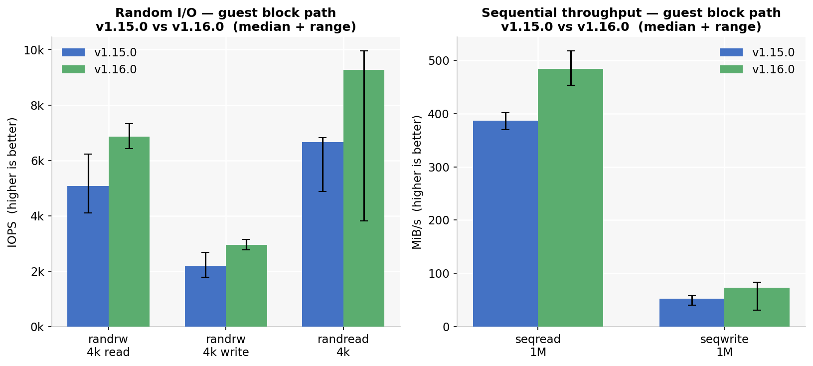

## Overview

Spinifex is an open-source infrastructure platform that brings core AWS services — EC2, EBS and S3 — to bare-metal, edge and on-prem environments. It exposes an EC2-compatible API, so tooling that works against AWS (the `aws` CLI, Terraform, SDKs) works against a Spinifex node unchanged, with a single profile swap.

This document covers a node deployment of Spinifex on the OnLogic HX401. The OnLogic HX401 is a fanless industrial box with 12 physical cores and 31 GiB of RAM — enough to run the full service set and still host a meaningful guest.

The goal of this deployment is to measure what the platform costs against bare metal — CPU overhead from virtualisation, guest block storage throughput, and S3 data-path performance. The same benchmark suite was run against both Spinifex v1.15.0 and v1.16.0 on the same hardware, to help the team quantify the efficacy of the new releases's fixes and improvements.

<p align="center"></p>

### Platform

| Component | Specification |
|---|---|
| **Bare-metal host** | OnLogic HX401 |
| **CPU** | Intel i5-1250PE — 12 physical cores / 16 threads |
| **Memory** | 31 GiB |
| **Storage** | Transcend TS256GMTE652T2, 256 GB NVMe (PCIe Gen3 x4) |
| **Host OS** | Debian 13 |
| **Orchestration** | Spinifex v1.16.0 — EC2-compatible bare-metal API |
| **Guest OS** | Ubuntu 26.04 LTS |
| **Instance type** | `c6i.2xlarge` — 8 vCPU, 16 GiB |
| **Block storage** | Viperblock — EBS-compatible, local NVMe-backed |
| **Object storage** | Predastore — S3-compatible, RS(1,0) on a single node |
| **Networking** | OVN, standalone NB/SB on the node itself |


## Prerequisites

- OnLogic HX401 (or comparable x86 node) running **Debian 13** or **Ubuntu 26.04 LTS**
- The WAN interface enslaved to a Linux bridge named `br-wan` — the host IP, default route and DHCP must live on the bridge, not the bare NIC
- A reserved range of addresses on your LAN for guest instances (this deployment uses `192.168.157.201-250`)
- AWS CLI installed

Verify the bridge before installing:

```bash
ip -br link show br-wan
ip route
```

## Instructions

### 1. Install Spinifex and initialise the node

Follow the [Single Node Install](/docs/install) guide, using `--nodes 1` to select the single-node templates — RS(1,0) storage and a one-member NATS.

**Set a static external pool.** `init` auto-detects the external network and will select `source = "dhcp"` when the host itself holds a DHCP lease. That does not work for guests on every network: the upstream server answers the host on `br-wan` but does not necessarily offer to guest ENI MAC addresses, and instance launches then fail with

```text
PrepareRunInstances: public IP allocation failed — aborting launch
dhcp DORA on br-wan: unable to receive an offer: context deadline exceeded
```

Edit `/etc/spinifex/spinifex.toml` to use a static range reserved for guests on your LAN:

```toml
[[network.external_pools]]
name        = "wan"
source      = "static"
range_start = "192.168.157.201"
range_end   = "192.168.157.250"
gateway     = "192.168.157.1"
prefix_len  = 24
dns_servers = ["1.1.1.1", "8.8.8.8"]
```

See the [VPC Networking](/docs/vpc-networking) guide for full configuration options. Then start the platform and verify:

```bash
sudo systemctl start spinifex.target
sudo spx get nodes
```

```text
NAME  | STATUS | ROLES       | IP              | REGION         | AZ              | VMs | SERVICES
node1 | Ready  | nats:leader | 192.168.157.134 | ap-southeast-2 | ap-southeast-2a | 0   | nats,predastore,viperblock,daemon,awsgw,vpcd,ui
```

### 2. Establish the bare-metal baseline

Benchmark the host before launching anything, with the platform idle. Without this, a slow guest result cannot be attributed to the platform rather than the hardware.

This uses `spx-bench.sh` — the same script is run on the host and inside the guest so the two results diff directly. It measures CPU (sysbench), memory, and disk (fio: `randrw` 70/30 4k, `randread` 4k, `seqread` 1M, `seqwrite` 1M, all at 4 jobs / iodepth 32 / `direct=1`).

```bash
./spx-bench.sh --tag host-baremetal
```

```text
--- 2. CPU (sysbench, events/sec — higher is better) ------------
  threads=1         1456.50 events/s   95th 0.70 ms
  threads=16       12822.85 events/s   95th 2.00 ms

--- 3. Memory --------------------------------------------------
  random write, 16 threads: 1555.84 MiB/sec

--- 4. Disk (file-backed, NVMe root) ---------------------------
  randrw 70/30 4k    read      66,169 IOPS    258 MiB/s   p99   10.42 ms
  randrw 70/30 4k    write     28,426 IOPS    111 MiB/s   p99    0.72 ms
  randread 4k        read     171,326 IOPS    669 MiB/s   p99    2.06 ms
  seqread 1M         read       1,818 IOPS  1,818 MiB/s   p99  128.45 ms
  seqwrite 1M        write        308 IOPS    308 MiB/s   p99 1115.68 ms
```

### 3. Launch a guest instance

```bash
aws ec2 run-instances \
  --image-id "$AMI" --instance-type c6i.2xlarge \
  --key-name onlogic --security-group-ids "$SG" --subnet-id "$SUBNET"
```

**Attach a data volume for the benchmark.** The stock `ubuntu-26.04-x86_64` AMI declares a 4 GiB root which fills just installing benchmark tools, and `run-instances` does not grow it without explicit `--block-device-mappings`. Every fio job fails with `ENOSPC` if you benchmark the root. Attach a gp3 volume instead, which is also the more representative target:

```bash
VOL=$(aws ec2 create-volume --availability-zone ap-southeast-2a \
  --size 30 --volume-type gp3 --query VolumeId --output text)
aws ec2 attach-volume --volume-id "$VOL" --instance-id "$ID" --device /dev/vdb
```

```bash
# in the guest
sudo mkfs.ext4 -q -L bench /dev/vdb
sudo mkdir -p /mnt/bench && sudo mount /dev/vdb /mnt/bench
```

### 4. Measure the guest

```bash
BENCHDIR=/mnt/bench ./spx-bench.sh --tag guest --require-mount
```

```text
--- 2. CPU (sysbench, events/sec — higher is better) ------------
  threads=1         1357.98 events/s   95th 0.75 ms
  threads=8         8608.31 events/s   95th 1.06 ms

--- 3. Memory --------------------------------------------------
  random write, 8 threads: 1133.25 MiB/sec
```

### 5. Measure the S3 data path

Predastore's S3 API listens on port `8443`. This is **not** the general AWS gateway endpoint on `9999`.

```bash
./s3-bench.sh 256    # 256 MB object, write + read + checksum verify
```

## Results

### CPU and memory

| | host | guest | guest/host |
|---|---|---|---|
| sysbench, 1 thread | 1,456 events/s | 1,358 events/s | **93.2%** |
| sysbench, all threads | 12,823 (16t) | 8,608 (8t) | not comparable |
| Memory random write | 1,556 MiB/s (16t) | 1,133 MiB/s (8t) | not comparable |

Single thread is the only directly comparable row, and **93.2% of bare metal** is the headline CPU number — roughly 7% single-thread virtualisation overhead. The multi-thread and memory rows use different thread counts (16 on the host, 8 in the guest) and are listed for completeness, not as ratios.

<p align="center"></p>

### Storage

Median of three runs. Guest measured on the attached gp3 volume.

| Test | host | guest | guest/host |
|---|---|---|---|
| randrw 70/30 4k read | 66,169 IOPS | 6,860 IOPS | 10.4% |
| randrw 70/30 4k write | 28,426 IOPS | 2,951 IOPS | 10.4% |
| randread 4k | 171,326 IOPS | 9,263 IOPS | 5.4% |
| seqread 1M | 1,818 MiB/s | 484 MiB/s | 26.6% |
| seqwrite 1M | 308 MiB/s | 73 MiB/s | 23.7% |

The block path is where virtualisation costs real throughput. Sequential work retains roughly a quarter of bare metal; small random I/O retains between a twentieth and a tenth.

<p align="center">


</p>

**Read the guest storage figures with their variance, not as point values.** Across three runs:

| Test | run 1 | run 2 | run 3 | spread |
|---|---|---|---|---|
| randrw 4k read | 7,321 | 6,424 | 6,860 | 14% |
| randread 4k | 9,959 | **3,813** | 9,263 | **2.6×** |
| seqread 1M | 518 | 484 | 453 | 14% |
| seqwrite 1M | 83 | 73 | **31** | **2.7×** |
| seqwrite p99 | 7.95 s | 7.28 s | **15.90 s** | 2.2× |

<p align="center"></p>

`randread` and `seqwrite` are bimodal rather than noisy around a mean — one run in three falls to roughly a third of its neighbours. The likely mechanism is a viperblock WAL flush or a Predastore compaction cycle landing inside some runs and not others. Anything below about a 3× change in those two metrics is not resolvable at this sample size.

`seqwrite` p99 reaching 7-16 seconds is worth attention before committing this platform to write-heavy edge workloads.

## Release comparison: v1.15.0 vs v1.16.0

Both releases were built from their release tags and installed on the same machine, each with a full re-initialisation, an identical `c6i.2xlarge` guest, and an identical 30 GiB gp3 volume. Three runs each.

### S3 / Predastore

| | v1.15.0 | v1.16.0 | change |
|---|---|---|---|
| write | 77.7 / 75.5 / 72.0 → **75.5 MiB/s** | 146.6 / 142.0 / 148.2 → **146.6 MiB/s** | **1.94× faster** |
| read | 249.9 / 234.9 / 243.8 → **243.8 MiB/s** | 298.1 / 301.8 / 290.9 → **298.1 MiB/s** | **1.22× faster** |

Checksums matched on every run. Run-to-run spread is about 4%, so both differences are far outside the noise.

**The mechanism is a changed default, not a faster code path.** On a single node:

```text
v1.15.0   [rs] data = 2, parity = 1     6 host entries
v1.16.0   [rs] data = 1, parity = 0     1 host entry
```

v1.15.0 splits every object into two data shards plus a parity shard and writes all three to the same disk — 1.5× write amplification plus the erasure-coding cost, buying no redundancy, because there is only one machine to lose. v1.16.0 ships a single-node storage template that does none of that.

The write path gains most (1.94×), which is what removing amplification and parity computation predicts. Reads gain less (1.22×) because the read path never had to reconstruct anything, only reassemble shards.

Anyone still running v1.15.0 on a single node should note that this is a configuration change as much as a software one.

<p align="center"></p>

### Guest block path

Medians of three runs, with the full range in brackets.

| Test | v1.15.0 | v1.16.0 | v1.16 gain |
|---|---|---|---|
| randrw 70/30 4k read | **5,075** IOPS [4,104-6,236] | **6,860** IOPS [6,424-7,321] | 1.35× |
| randrw 70/30 4k write | **2,191** IOPS [1,771-2,684] | **2,951** IOPS [2,764-3,147] | 1.35× |
| randread 4k | **6,658** IOPS [4,881-6,813] | **9,263** IOPS [3,813-9,959] | 1.39× |
| seqread 1M | **387** MiB/s [370-402] | **484** MiB/s [453-518] | 1.25× |
| seqwrite 1M | **52** MiB/s [40-58] | **73** MiB/s [31-83] | 1.40× |
| seqwrite p99 | **13.89 s** [13.76-17.11] | **7.95 s** [7.28-15.90] | 1.75× lower |

<p align="center"></p>

v1.16.0 is ahead on every median, by 1.25× to 1.40×. For `randrw` read, `randrw` write and `seqread` the two ranges **do not overlap at all**, so those differences are credible despite only three runs each. For `randread` and `seqwrite` the ranges do overlap — entirely because of v1.16.0's bimodal low outliers — so treat those two as directionally consistent rather than demonstrated.

This is the indirect effect of the storage template change. Viperblock's own code is unchanged between the releases, but it writes through Predastore, so removing the 1.5× write amplification and parity computation underneath reduces the work behind every guest block flush as well.

## Teardown

```bash
aws ec2 terminate-instances --instance-ids "$ID"
aws ec2 delete-volume --volume-id "$VOL"      # after the instance is terminated
aws ec2 delete-security-group --group-id "$SG"
```

Terminate instances before deleting attached volumes — the volume detaches with the instance, not before it.

## Conclusion

A single OnLogic HX401 runs the complete Spinifex service set — EC2, EBS, S3, VPC networking and DNS — and hosts an 8 vCPU guest with room to spare. Guest CPU performance lands at **93.2% of bare metal**, a figure that reproduced on separate hardware.

The release comparison is the most actionable result here. Moving from v1.15.0 to v1.16.0 on identical hardware gave **1.94× S3 write throughput** and **1.25-1.40× on every guest block metric** — not because the data paths were rewritten, but because the single-node storage template stopped erasure-coding data across a machine that has only one disk. v1.15.0 wrote two data shards and a parity shard to the same NVMe, paying 1.5× write amplification and the encode cost for redundancy it could never deliver.

Every operation in this document used standard `aws ec2` and `aws s3api` calls against Spinifex's EC2-compatible endpoint. Teams already operating AWS tooling can point it at an edge node with a profile change.
