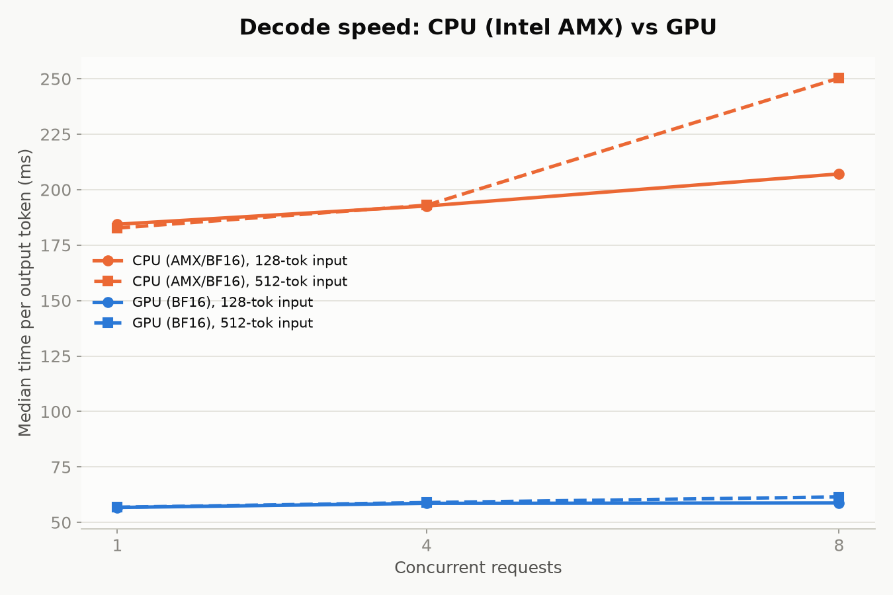
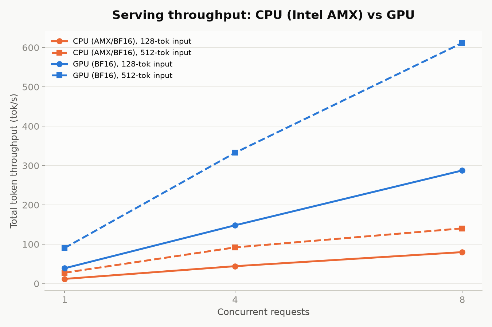

## Overview

Spinifex is an open-source infrastructure platform that brings core AWS services — EC2,
S3, EBS, VPC and EKS — to bare-metal, edge, and on-prem deployments, exposing a fully
AWS-compatible API.

This document serves Qwen2.5-7B-Instruct with vLLM on the same 3-node Cisco Unified Edge
cluster, comparing Intel AMX-accelerated CPU serving on an `m8i.2xlarge`-class instance
against NVIDIA L4 GPU serving on a `g6.2xlarge`-class instance — a real,
production-representative LLM-serving stack, with the two accelerators measured independently at matched model, version, and serving configuration.

**Companion architectures:** [Cisco UCS: AWS-compatible cloud at the edge](/docs/cisco-ucs-platform-benchmark) · [Spinifex Vision Pipeline on Cisco UCS](/docs/cisco-ucs-vision-pipeline)

### Platform

| Component | Specification |
|---|---|
| **Chassis** | 3× Cisco Unified Edge, single-socket each |
| **CPU** | 1× Intel Xeon 6543P-B per node — 32 cores / 64 threads, 800 MHz–3.30 GHz |
| **Cache / NUMA** | L3 128 MB (unified), single NUMA node per host |
| **ISA** | AVX-512 (F/DQ/BW/VL/VNNI/BF16/FP16), **Intel AMX** (tile/BF16/INT8), VT-x, VT-d |
| **Memory** | 499 GiB usable per node (≈1.5 TiB aggregate) |
| **GPU** | 1× NVIDIA L4 (23,034 MiB) via VFIO PCIe passthrough on one node; the other two nodes are CPU-only |
| **Storage** | 4× KIOXIA CD8P NVMe (1.92 TB each) per node, raw — Predastore/Viperblock claim these directly |
| **Boot** | Cisco SATA RAID VD (Marvell 88SE9230 controller) |
| **Network** | 2× Intel E825-C 25GbE ports per node — one bond for management/WAN (VLAN 1337), one for storage/cluster traffic (VLAN 1336, full 25GbE) |
| **Aggregate** | 96 cores / 192 threads, ~1.5 TiB RAM, ~23 TiB raw NVMe, 1× L4 GPU |

### Workloads

| Instance | Role | Engine | Precision |
|---|---|---|---|
| `cpu1` (`m8i.2xlarge`) | LLM serving | vLLM (CPU backend), Intel AMX | BF16 |
| `gpu` (`g6.2xlarge`) | LLM serving | vLLM (CUDA backend), NVIDIA L4 | BF16 |

Same model, same vLLM version, same serving stack, deployed independently on each
instance — no request routing or load balancing between them; this measures each
accelerator's serving characteristics in isolation.

## Architecture

### AWS services exercised

| Service | Role |
|---|---|
| **EC2** | One `m8i.2xlarge` instance (CPU serving) and one `g6.2xlarge` instance (GPU serving), on separate physical nodes — the latter on the one node with GPU passthrough configured |

## Prerequisites

- 3-node Spinifex cluster installed and services healthy on all nodes — follow the [Multi-Node Install](/docs/install-multi-node) guide, then verify with `spx get nodes`
- GPU passthrough configured on the one node with the NVIDIA L4 — see [GPU Passthrough](/docs/gpu-passthrough):

```bash
sudo spx admin gpu setup   # reboot required after this step
sudo spx admin gpu enable
```

- One `m8i.2xlarge` (`cpu1`) and one `g6.2xlarge` (`gpu`) instance provisioned and reachable — the `gpu` instance must land on the node with passthrough configured; see [Launching Instances](/docs/launching-instances) for the full provisioning workflow including VPC, key pair, and security group setup
- ~20 GB free disk per instance for model weights
- Python 3.14, `pip install vllm` (GPU instance) or the CPU wheel with
  `--extra-index-url https://download.pytorch.org/whl/cpu` (CPU instance) —
  vLLM 0.26.0 / PyTorch 2.11.0 on both, `torch+cu130` on the GPU instance,
  `torch+cpu` on the CPU instance

## Instructions

### 1. Download the model

```bash
hf download Qwen/Qwen2.5-7B-Instruct \
  --revision a09a35458c702b33eeacc393d103063234e8bc28 \
  --local-dir ./Qwen2.5-7B-Instruct
```

Pinned to a specific commit (Apache-2.0 licensed) for reproducibility, on both
instances identically.

### 2. Launch the server

```bash
# cpu1 — Intel AMX via the CPU backend
VLLM_CPU_KVCACHE_SPACE=4 vllm serve ./Qwen2.5-7B-Instruct \
  --served-model-name Qwen2.5-7B-Instruct \
  --host 0.0.0.0 --port 8000 --dtype bfloat16 --max-model-len 4096

# gpu — NVIDIA L4 via the CUDA backend
VLLM_USE_FLASHINFER_SAMPLER=0 vllm serve ./Qwen2.5-7B-Instruct \
  --served-model-name Qwen2.5-7B-Instruct \
  --host 0.0.0.0 --port 8000 --dtype bfloat16 --max-model-len 4096 \
  --gpu-memory-utilization 0.85
```

Two environment-specific workarounds were needed on this cluster, worth recording for
anyone reproducing this:

- **cpu1**: vLLM's compiled extension (`vllm/_C.abi3.so`) shipped with an executable-stack
  ELF flag (`GNU_STACK` = RWE) that this guest kernel refuses to `mprotect`
  (`cannot enable executable stack as shared object requires: Invalid argument`),
  crashing the server at import time. Fixed with `patchelf --clear-execstack
  vllm/_C.abi3.so` — a one-time, host-local binary patch, not a vLLM or model issue.
- **gpu**: this instance has no CUDA toolkit (`nvcc`) installed, only the driver/runtime —
  fine for running pre-built PyTorch/CUDA kernels, but vLLM's default sampler
  (FlashInfer) JIT-compiles a kernel on first use and fails without `nvcc`.
  `VLLM_USE_FLASHINFER_SAMPLER=0` falls back to vLLM's native PyTorch sampler, which
  needs no compilation step.

### 3. Confirm Intel AMX is executing for this workload

CPUID flags alone don't prove AMX is in use. The proof is oneDNN's own kernel-selection
trace during real vLLM chat-completion requests:

```bash
ONEDNN_VERBOSE=1 vllm serve ./Qwen2.5-7B-Instruct ... 2> serve_cpu1.log
# ...send requests...
grep -o 'avx10_1_512_amx[a-z_0-9]*\|avx512_core[a-z_0-9]*' serve_cpu1.log | sort -u
```

| Kernel | Selections during serving |
|---|---:|
| `avx10_1_512_amx` | 452 |
| `avx512_core` (fallback) | 0 |

**Zero fallback** — every matmul in this run went through AMX. A full-BF16 transformer's
matmuls are more uniformly AMX-eligible than a quantized detection model, where
unquantized layers can still fall back to `avx512_core`.

### 4. Benchmark: `vllm bench serve`

vLLM's own benchmark CLI (`vllm bench serve`) is used directly rather than a custom
harness — it already reports the percentiles that matter for serving (TTFT, TPOT, ITL,
E2E latency) against a fixed-length synthetic dataset with controllable concurrency:

```bash
vllm bench serve \
  --backend openai-chat --base-url http://localhost:8000 \
  --endpoint /v1/chat/completions --model Qwen2.5-7B-Instruct \
  --dataset-name random --random-input-len <128|512> --random-output-len 128 \
  --max-concurrency <1|4|8> --num-prompts $((concurrency * 10)) \
  --percentile-metrics ttft,tpot,itl,e2el --ignore-eos --save-result
```

Matrix: 2 input lengths (128, 512 tokens) × 3 concurrency levels (1, 4, 8) × 3 repeats
per cell, 128 output tokens fixed throughout, 36 runs total, **zero failed requests**
across the full matrix. Figures below are the mean of each cell's 3 repeats (median
metric per run). Raw per-run JSON results are available in the
[LLM serving repository](https://github.com/mulgadc/cisco-ucs-llm-serving).





| Engine | Input tok | Concurrency | TTFT p50 (ms) | TPOT p50 (ms) | E2E p50 (ms) | Output tok/s | Total tok/s |
|---|---:|---:|---:|---:|---:|---:|---:|
| CPU (AMX) | 128 | 1 | 409.8 | 184.4 | 23,832 | 5.37 | 11.97 |
| CPU (AMX) | 128 | 4 | 1,432.0 | 192.6 | 25,795 | 19.89 | 44.28 |
| CPU (AMX) | 128 | 8 | 868.0 | 207.1 | 28,510 | 35.94 | 80.02 |
| CPU (AMX) | 512 | 1 | 932.4 | 182.7 | 24,141 | 5.29 | 27.65 |
| CPU (AMX) | 512 | 4 | 5,737.0 | 193.0 | 30,259 | 17.61 | 92.04 |
| CPU (AMX) | 512 | 8 | 6,289.1 | 250.3 | 38,029 | 26.86 | 140.40 |
| GPU (L4) | 128 | 1 | 91.9 | 56.7 | 7,297 | 17.53 | 39.04 |
| GPU (L4) | 128 | 4 | 264.0 | 58.6 | 7,724 | 66.54 | 148.17 |
| GPU (L4) | 128 | 8 | 240.6 | 58.8 | 7,807 | 129.14 | 287.54 |
| GPU (L4) | 512 | 1 | 171.4 | 56.8 | 7,389 | 17.33 | 90.59 |
| GPU (L4) | 512 | 4 | 520.8 | 59.0 | 8,173 | 63.62 | 332.52 |
| GPU (L4) | 512 | 8 | 894.1 | 61.5 | 8,746 | 117.02 | 611.63 |

**Decode speed (TPOT) is ~3.2–3.3x faster on the GPU** at concurrency 1 — a
load-independent ratio that reflects the accelerators themselves. Under concurrency the
GPU holds nearly flat (TPOT +8.3% from C=1 to C=8 at 512-token input) while the CPU
degrades (+37.0% over the same range), widening the total throughput gap from 3.3x solo
to 4.4x at C=8.

**Prefill (TTFT) degrades more sharply than decode on both engines, and worse on CPU**:
at 512-token input, CPU TTFT rises 6.7x (932→6,289 ms) versus the GPU's 5.2x
(171→894 ms). Both effects are expected — concurrent requests share the same finite
compute for both prefill and decode, and the CPU simply has less of it.

### 5. Teardown

```bash
# Stop the vLLM server on each instance
pkill -f 'vllm serve'
```

### 6. Conclusion

vLLM serving Qwen2.5-7B-Instruct on this cluster confirms Intel AMX executing at the
kernel level with zero fallback, and quantifies what that's actually worth against the
NVIDIA L4: a stable ~3.2–3.3x GPU decode-speed advantage at low load, widening to
~4.4x aggregate throughput under concurrent load as CPU prefill and decode both degrade
faster than the GPU's dedicated compute on the same 8-vCPU guest width. The degradation
is inherent finite-compute sharing inside a properly-threaded engine, and sets a concrete
ceiling for how many concurrent LLM-serving requests to expect from a single
`m8i.2xlarge`-class guest.

For a CPU-only path, the absolute numbers hold up better than the GPU-relative gap might
suggest. AMX delivers ~5.4 output tok/s per request at C=1 on a 7B model — practical for
non-interactive or batch workloads — and scales to 26.9 tok/s aggregate at C=8 on a
single instance, with zero fallback from the AMX instruction path confirmed. In edge or
cost-constrained deployments where a GPU isn't available, or where request volume is low
enough that dedicated GPU compute would sit largely idle between bursts, the CPU path is a
deployable option rather than a fallback of last resort. The GPU wins clearly on
latency and throughput at scale; AMX makes the CPU competitive enough that the choice is
meaningful rather than obvious.

Both serving instances were provisioned through Spinifex's EC2-compatible endpoint as standard EC2 instance types — `m8i.2xlarge` for the CPU path, `g6.2xlarge` for the GPU path — with standard `aws ec2` CLI calls. Teams already operating AWS infrastructure can point their existing tooling at a Spinifex node with a single profile swap.
