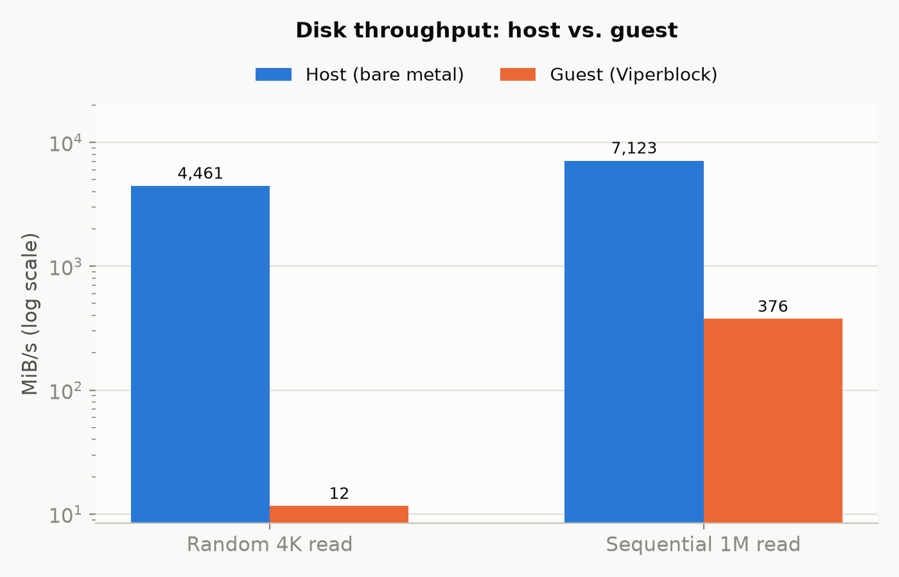
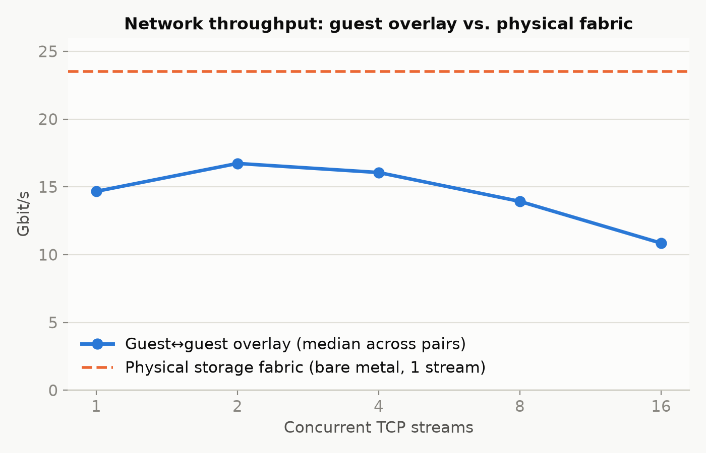
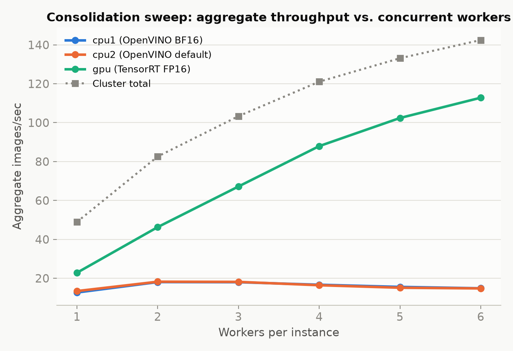
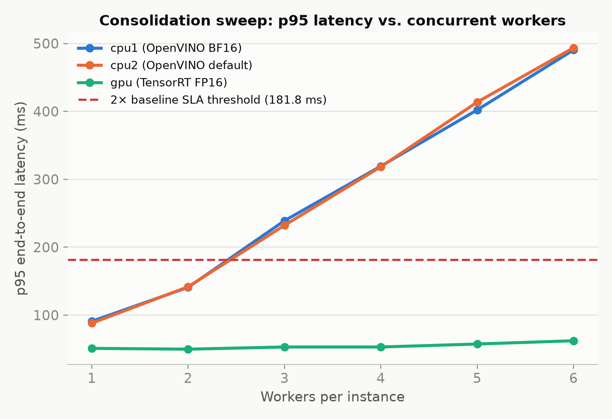

## Overview

Spinifex is an open-source infrastructure platform that brings core AWS services — EC2,
S3, EBS and EKS — to bare-metal, edge, and on-prem deployments, exposing a fully
AWS-compatible API.

This document characterizes the platform itself on a 3-node Cisco Unified Edge cluster,
independent of any specific application: CPU, disk, network, and S3 (Predastore)
throughput measured identically on bare metal and inside guest instances, and how many
concurrent worker processes each instance can sustain before latency degrades.

**Companion documents:** [Spinifex Vision Pipeline on Cisco UCS](../cisco-ucs-vision-pipeline/README.md) · [vLLM Serving on Cisco UCS: Intel AMX vs NVIDIA L4](../cisco-ucs-llm-serving/README.md)

### Platform

| Component | Specification |
|---|---|
| **Chassis** | 3× Cisco Unified Edge, single-socket each |
| **CPU** | 1× Intel Xeon 6543P-B per node — 32 cores / 64 threads, 800 MHz–3.30 GHz |
| **Cache / NUMA** | L3 128 MB (unified), single NUMA node — no vCPU/memory locality tuning needed |
| **ISA** | AVX-512 (F/DQ/BW/VL/VNNI/BF16/FP16), **Intel AMX** (tile/BF16/INT8), VT-x, VT-d |
| **Memory** | 499 GiB usable per node (≈1.5 TiB aggregate) |
| **GPU** | 1× NVIDIA L4 (23,034 MiB) via VFIO PCIe passthrough on one node; the other two nodes are CPU-only |
| **Storage** | 4× KIOXIA CD8P NVMe (1.92 TB each) per node, raw — Predastore/Viperblock claim these directly |
| **Boot** | Cisco SATA RAID VD (Marvell 88SE9230 controller) |
| **Network** | 2× Intel E825-C 25GbE ports per node, each its own bond: one for management/WAN (VLAN 1337, 1 Gbps upstream uplink), one dedicated to storage/cluster traffic (VLAN 1336, full 25GbE) |
| **Aggregate** | 96 cores / 192 threads, ~1.5 TiB RAM, ~23 TiB raw NVMe, 1× L4 GPU |

Single-NUMA-per-node is a meaningful simplification versus a typical dual-socket
reference design — no vCPU/memory locality tuning required for VM placement. The GPU is
present on one node only — GPU-accelerated instances are bound to that node, while
CPU-only instances can schedule across all three.

## Prerequisites

- 3-node Spinifex cluster installed and services healthy on all nodes — follow the [Multi-Node Install](/docs/install-multi-node) guide.
- VPC, network pool, SSH key pair, and security group configured — see [VPC Networking](/docs/vpc-networking) and [Launching Instances](/docs/launching-instances)
- GPU passthrough configured on the one node with the NVIDIA L4 — see [GPU Passthrough](/docs/gpu-passthrough):

```bash
sudo spx admin gpu setup   # reboot required after this step
sudo spx admin gpu enable
```

- AWS CLI configured with `AWS_PROFILE=spinifex` pointing at the cluster's EC2-compatible endpoint

## Instructions

Benchmark scripts and raw results for all sections below are available in the
[platform benchmark repository](https://github.com/mulgadc/cisco-ucs-platform-benchmark).

### 1. Matched-width CPU

sysbench, identical thread counts, run on bare metal and inside a guest of the same vCPU
width:

| Scope | Target | Median events/s |
|---|---|---:|
| host | mulga-01 | 8,205.4 |
| host | mulga-02 | 8,209.3 |
| host | mulga-03 | 8,210.4 |
| guest | cpu1 | 8,168.4 |
| guest | cpu2 | 8,174.0 |
| guest | gpu | 8,160.8 |

Guests land within ~0.5% of host — virtualization overhead on this platform is
negligible for CPU-bound work.

### 2. Confirm Intel AMX is actually executing

Intel AMX (Advanced Matrix Extensions) is a relatively new instruction set available on
the Xeon 6543P-B, designed specifically to accelerate the matrix operations that dominate
AI inference workloads. CPUID flags alone don't prove it's actually in use — the proof
is oneDNN's own kernel-selection trace during a real inference run at each precision:

```bash
ONEDNN_VERBOSE=1 python3 <any BF16-hinted inference workload> 2> onednn-verbose.log
grep -o 'avx10_1_512_amx[a-z_]*\|avx512_core[a-z_]*' onednn-verbose.log | sort -u
```

| Precision | Kernel selected |
|---|---|
| FP32 (forced, negative control) | `avx512_core` only — **zero** AMX kernel selections |
| BF16 | `avx10_1_512_amx` |
| INT8 | `avx10_1_512_amx` (+ one `avx512_core` fallback for an unquantized matmul) |

`avx10_1_512_amx` is the current kernel-naming scheme on this hardware generation — not
the older `brgemm_avx512_amx*` string some documentation still references. Confirmed by
direct trace inspection, not inferred from CPUID or throughput alone.

### 3. Disk — host versus guest

fio, file-backed (non-destructive), identical parameters on bare metal and inside a
guest:

| Metric | Host (mulga-01) | Guest (cpu1, idle) | Ratio |
|---|---:|---:|---:|
| Random 4K read | 4,460.8 MiB/s | 11.6 MiB/s | ~1/385 |
| Sequential 1M read | 7,122.6 MiB/s | 375.5 MiB/s | ~1/19 |



Guest I/O traverses Viperblock's NBD path; the random 4K gap is far larger than the sequential 1M gap because small requests pay the full per-request serialization overhead without amortizing it across a large transfer. This is a known area for improvement in upcoming Spinifex releases.

### 4. Network — physical fabric versus guest overlay

iperf3, matched methodology, on the physical storage fabric (bare metal) and between
guest instances over the OVN/Geneve overlay:

| Path | Streams | Median Gbit/s |
|---|---:|---:|
| Physical storage fabric (bare metal) | 1 | 23.5 (≈94% of 25GbE line rate) |
| Guest↔guest | 1 | 13.4–20.0 |
| Guest↔guest | 2–4 | 14.5–19.0 |
| Guest↔guest | 16 | 10.3–13.3 |



Guest-to-guest throughput lands 20–45% below the physical fabric depending on stream
count and pairing.

The gap is primarily single-queue virtio-net — `ethtool -l` on all three guest instances
reports `Combined: 1` with no guest-configurable multiqueue support, concentrating all
network work on a single core regardless of vCPU count. This explains why 16 concurrent
streams perform *worse* than 1: they compete for the same queue rather than
parallelizing. Geneve encapsulation reduces tenant MTU to 1408 (TCP MSS 1356), adding a
smaller compounding overhead on top.

### 5. Predastore (S3) throughput

Three simultaneous clients per side, one per physical node, over HTTPS to the cluster's
S3 endpoint:

| Direction | Guest-aggregate | Host-aggregate |
|---|---:|---:|
| Read | 175.1 MiB/s | 299.0 MiB/s |
| Write | 293.1 MiB/s | 124.1 MiB/s |

Reads run 1.71x faster on the host aggregate than guest. Write reverses — guests
outperform the host (293.1 vs 124.1 MiB/s).

### 6. Worker concurrency per instance — how many processes can each node sustain

With one EC2 instance per physical node (3 instances fixed), we
scale the number of concurrent worker processes within each instance from 1 to N, until
p95 request latency exceeds 2x the single-worker baseline or aggregate throughput stops
improving. Load generator: OpenVINO/YOLO11m inference against Predastore (CPU workers) and
TensorRT/YOLO11m (GPU worker).

| Workers/instance | Total workers | Aggregate img/s | cpu1 p95 (ms) | cpu2 p95 (ms) | gpu p95 (ms) |
|---:|---:|---:|---:|---:|---:|
| 1 | 3 | 49.0 | 90.9 | 88.1 | 51.0 |
| 2 | 6 | 82.6 | 140.9 | 141.7 | 49.8 |
| 3 | 9 | 103.3 | 239.0 | 232.2 | 53.0 |
| 4 | 12 | 121.1 | 319.3 | 318.4 | 53.0 |
| 5 | 15 | 133.1 | 402.1 | 413.6 | 57.4 |
| 6 | 18 | 142.5 | 490.4 | 493.6 | 62.2 |






Both CPU workers track each other closely across the entire sweep (e.g. 18.05 vs.
18.25 img/s at N=2, 490.4 vs. 493.6 ms p95 at N=6), consistent with identical hardware
on identical nodes.

**CPU workers' aggregate throughput peaks at 2 workers/instance (~18.1 img/s each) and
declines steadily from there** (~16.6 at N=4, ~14.8 at N=6), while p95 latency climbs
almost linearly with N (91–88 ms → ~490 ms, a ~5.4–5.6x increase over the sweep) — **the
2x-baseline SLA is breached at 3 workers/instance** (239.0 ms cpu1 / 232.2 ms cpu2 vs. a
181.8 ms / 176.2 ms threshold respectively) and never recovers. Both signals agree: **the
practical ceiling for this CPU-bound workload is 2 workers/instance (6/cluster)** if
throughput is the priority, or 2 if latency matters at all — by 3 it's already costing
more than it gains.

**The GPU worker shows no strain through the full sweep** — p95 stays essentially flat
(51.0–62.2 ms, well under its own 102.0 ms breach threshold) and aggregate throughput
keeps climbing almost linearly through 6 workers/instance (22.85 → 112.82 img/s, a ~4.9x
increase for 6x the load) — consistent with the L4 sitting at only 22–35% utilisation under a single worker. The sweep was capped at 6
workers/instance by design; the GPU's actual ceiling is higher and wasn't reached here.

**Predastore itself is not the limiting subsystem for this result.** mulga-01's
Predastore CPU% is already elevated (85.4%) at N=1, briefly exceeds 100% at N=2
(119.0%, multi-threaded process accounting), and settles at 93.2% by N=6 — it fluctuates
around a high baseline rather than climbing *with* N the way the observed CPU-worker
degradation does, and the other two nodes' Predastore CPU% (27–50%) never comes close.

The cause is CPU-compute contention rather than storage or network: inference latency
grows ~11x across the sweep while S3 read/write latency grows only ~24–40%, and each
OpenVINO worker consumes roughly 3.5 cores unpinned — oversubscribing the 8-vCPU guest
by N=3, which lines up exactly with the observed SLA breach.

### 7. Conclusion

On matched-width CPU work, guests cost virtually nothing versus bare metal (~0.5%), and
Intel AMX is confirmed executing at the kernel-selection level, not just present in
CPUID. Network and disk both show real overhead versus bare metal — guest network at 20–45% below the physical fabric, guest disk far more so,
currently the platform's clearest area for near-term improvement. The practical ceiling
for CPU-bound concurrent work is 2 worker processes per 8-vCPU instance before latency
degrades — confirmed as compute contention rather than a storage or network ceiling —
while the GPU instance shows no strain through the full sweep, consistent with the L4
sitting at 22–35% utilisation under a single worker.

All benchmark instances were provisioned through Spinifex's EC2-compatible endpoint using standard `aws ec2` CLI calls — the same instance types, placement groups, and security groups that work on AWS work here unchanged. Teams already operating AWS infrastructure can point their existing tooling at a Spinifex node with a single profile swap.
