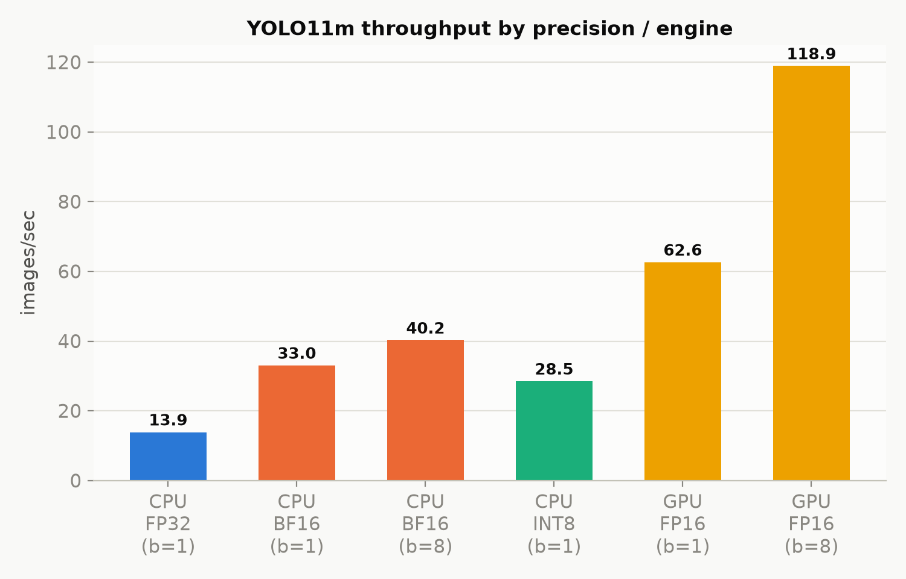
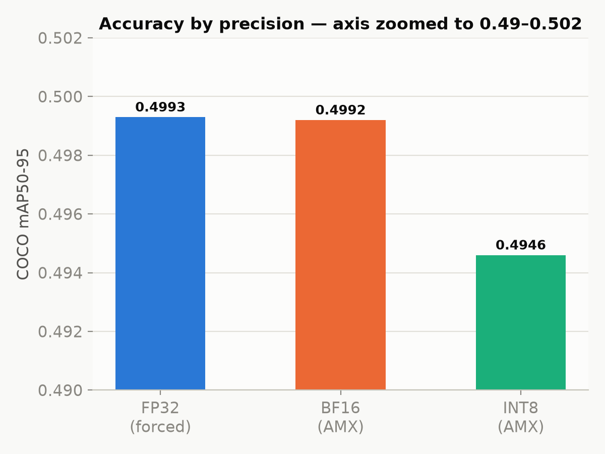
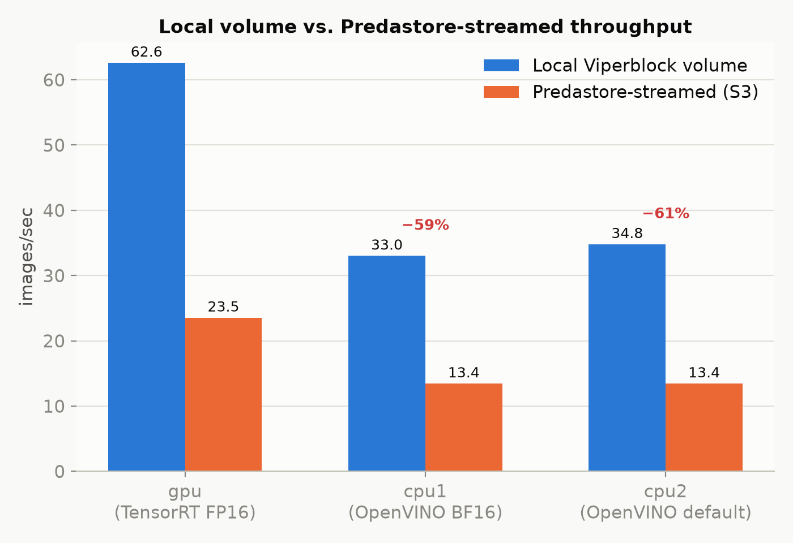

## Overview

Spinifex is an open-source infrastructure platform that brings core AWS services — EC2,
S3, EBS, VPC and EKS — to bare-metal, edge, and on-prem deployments. It exposes a fully
AWS-compatible API, so standard tooling (the `aws` CLI, Terraform) works against a
Spinifex cluster unchanged, with a single profile/endpoint swap.

This guide walks through a computer-vision pipeline built on a 3-node Cisco Unified Edge
cluster running Spinifex: real-time object detection plus a vision-language model
producing plain-English scene descriptions, both streaming from the same shared Predastore
(S3-compatible) bucket as two entirely independent EC2-compatible instances.

**Companion architectures:** [Cisco UCS: AWS-compatible cloud at the edge](/docs/cisco-ucs-platform-benchmark) · [vLLM Serving on Cisco UCS: Intel AMX vs NVIDIA L4](/docs/cisco-ucs-llm-serving)

### Platform

| Component | Specification |
|---|---|
| **Chassis** | 3× Cisco Unified Edge, single-socket each |
| **CPU** | 1× Intel Xeon 6543P-B per node — 32 cores / 64 threads, 800 MHz–3.30 GHz |
| **Cache / NUMA** | L3 128 MB (unified), single NUMA node per host |
| **ISA** | AVX-512 (F/DQ/BW/VL/VNNI/BF16/FP16), **Intel AMX** (tile/BF16/INT8), VT-x, VT-d |
| **Memory** | 499 GiB usable per node (≈1.5 TiB aggregate) |
| **GPU** | 1× NVIDIA L4 (23,034 MiB) via VFIO PCIe passthrough on one node; the other two nodes are CPU-only |
| **Storage** | 4× KIOXIA CD8P NVMe (1.92 TB each) per node, raw — Predastore/Viperblock claim these directly |
| **Boot** | Cisco SATA RAID VD (Marvell 88SE9230 controller) |
| **Network** | 2× Intel E825-C 25GbE ports per node — one bond for management/WAN (VLAN 1337), one for storage/cluster traffic (VLAN 1336, full 25GbE) |
| **Aggregate** | 96 cores / 192 threads, ~1.5 TiB RAM, ~23 TiB raw NVMe, 1× L4 GPU |

### Workloads

| Instance | Role | Engine | Node |
|---|---|---|---|
| `cpu1` (`m8i.2xlarge`) | Real-time YOLO11m object detection | OpenVINO, CPU (AMX/BF16) | either CPU-only node (spread placement group) |
| `gpu` (`g6.2xlarge`) | Qwen2-VL-2B scene captioning | PyTorch/Transformers, NVIDIA L4 | the GPU-equipped node (only one of three has an L4) |
| `cpu2` (`m8i.2xlarge`) | Consolidation/failure-testing capacity | OpenVINO, CPU | either CPU-only node (spread placement group) |

The detection worker reads a frame from Predastore, runs YOLO11m, and posts the
annotated frame; the captioning worker independently reads the same raw frame
from Predastore and produces a one-sentence description with
Qwen2-VL-2B — two instances, two different accelerators, one shared object store.

## Architecture

### AWS services exercised

| Service | Role |
|---|---|
| **EC2** | 3× guest instances (1 GPU, 2 CPU), spread placement group — one instance per physical node |
| **S3 (Predastore)** | Central image bucket; both YOLO and VLM workers read from it independently over HTTPS |
| **EBS (Viperblock)** | Root + dedicated data volume per instance — survives instance termination/replacement independently |
| **VPC (OVN)** | Overlay networking between guests |

## Prerequisites

- 3-node Spinifex cluster installed and services healthy on all nodes — follow the [Multi-Node Install](/docs/install-multi-node) guide.
- VPC, network pool, SSH key pair, and security group configured — see [VPC Networking](/docs/vpc-networking) and [Launching Instances](/docs/launching-instances)
- GPU passthrough configured on the one node with the NVIDIA L4 — see [GPU Passthrough](/docs/gpu-passthrough):

```bash
sudo spx admin gpu setup   # reboot required after this step
sudo spx admin gpu enable
```

- AWS CLI configured with `AWS_PROFILE=spinifex` pointing at the cluster endpoint (`https://<host>:9999`)
- [OpenTofu](https://opentofu.org/) >= 1.6 installed locally

### Clone the workbook

```bash
git clone https://github.com/mulgadc/cisco-ucs-vision-pipeline
cd cisco-ucs-vision-pipeline
```

## Instructions

### 1. Provision the three instances

```bash
cd terraform/
terraform apply
```

One `g6.2xlarge` (GPU) and two `m8i.2xlarge` (CPU) instances in a spread placement
group — Spinifex schedules spread-group members onto distinct physical nodes, so each
instance lands on a different one of the three. The `gpu` instance must land on the one
node with GPU passthrough configured; the spread group guarantees the two CPU instances
land on the remaining two nodes. A dedicated Viperblock data volume per
instance (separate from the root volume, `delete_on_termination = false`) survives
instance termination/replacement independently — relaunching a terminated instance
reattaches the same volume rather than starting from empty storage.

```
gpu_instance  = { id = "i-...", public_ip = "192.168.12.151", type = "g6.2xlarge" }
cpu_instances = [
  { id = "i-...", public_ip = "192.168.12.152", type = "m8i.2xlarge" },
  { id = "i-...", public_ip = "192.168.12.154", type = "m8i.2xlarge" },
]
```

### 2. CPU (Intel AMX) vs GPU precision comparison

Before running the live pipeline, this section characterises each accelerator's
throughput and accuracy on YOLO11m in isolation. Intel AMX (Advanced Matrix Extensions)
is a relatively new instruction set, first introduced with 4th-gen Xeon Scalable
(Sapphire Rapids, 2023) and supported by the Xeon 6543P-B CPUs in these nodes, designed
to accelerate the matrix operations that dominate AI and ML workloads. Running AMX head-to-head against
the NVIDIA L4 directly answers how much a modern, AI-targeted CPU instruction set can
close the gap to GPU without any discrete accelerator.

YOLO11m at 640×640, COCO val2017 (5,000 images), fixed image order, 20-image warm-up
excluded, COCO mAP validated per configuration (not just throughput — an unvalidated
speed number is not a valid quantization comparison). CPUID flags alone don't prove AMX
is executing — the proof is oneDNN's own kernel-selection trace during real inference. On
this hardware, BF16 workloads select `avx10_1_512_amx` (the current naming scheme for
this CPU generation — not the older `brgemm_avx512_amx*` string some documentation
references); FP32 selects `avx512_core` only, with zero AMX selections. The table below
measures what that kernel difference is worth on YOLO11m:

| Precision / engine | Batch | images/s | mAP50-95 |
|---|---:|---:|---:|
| CPU, FP32 (forced, negative control) | 1 | 13.88 | 0.4993 |
| CPU, BF16 (AMX) | 1 | 33.02 | 0.4992 |
| CPU, BF16 (AMX) | 8 | 40.23 | — |
| CPU, INT8 (AMX) | 1 | 28.48 | 0.4946 |
| GPU, TensorRT FP16 | 1 | 62.60 | 0.5067 |
| GPU, TensorRT FP16 | 8 | 118.90 | — |





**BF16/AMX gives a real 2.4–3.1x throughput gain over true FP32 on this hardware, at
essentially zero accuracy cost** (Δ mAP50-95 = −0.0001). INT8 costs a small but real
−0.9% relative mAP and, counter to the usual expectation, ran *slower* than BF16 — the
default quantization left some layers unquantized, introducing dequant/requant overhead
that BF16's uniform precision avoids entirely.

GPU beats the best CPU path by ~3x at only 22–35% GPU utilisation — headroom-rich, with
host-side pre/post-processing (letterbox, NMS) bundled into the reported figures
alongside GPU inference itself.

### 3. Local volume vs Predastore-streamed

Same engines, now reading frames over S3 and writing detections back, instead of from
the instance's own local Viperblock volume:

| Worker | Local images/s | S3-streamed images/s | Drop |
|---|---:|---:|---:|
| gpu (TensorRT FP16) | 62.60 | 23.54 | −62% |
| cpu1 (OpenVINO BF16) | 33.02 | 13.44 | −59% |
| cpu2 (OpenVINO default) | ~34.79 | 13.44 | −61% |



A solo cpu1 S3 run (no concurrent workers) scored 12.53 img/s — essentially identical to
its 3-worker-concurrent number (13.44). **Concurrency from the other two workers cost
cpu1 almost nothing** — the clearest evidence the storage-request latency itself, not
contention between workers, is the limiter. Per-image latency breakdown confirms it:
GPU's S3 round-trip (read+write ≈ 30.6 ms) is ~5x its actual inference cost (5.7 ms) —
each frame is a small object (~163 KB), so this is a per-request-latency-bound access
pattern, not a bandwidth-bound one. A production pipeline would batch/pipeline S3 reads
rather than one GET per frame.

The ~30 ms round-trip at this object size (~163 KB) is dominated by fixed per-request
cost — HTTPS/TLS, sigv4 signing, and the OVN gateway-chassis hop — rather than
bandwidth. S3 latency grows only ~24–40% as workers scale while inference time grows
~11x, confirming the round-trip is a fixed per-request tax, not a contention effect.

### 4. Demo dashboard

```bash
cd demo-dashboard/
./venv/bin/uvicorn server:app --host 0.0.0.0 --port 8090
```

A local FastAPI dashboard renders the pipeline live: the annotated detection feed, the
VLM's scene caption, GPU
utilisation/power, Predastore CPU%, and per-instance Predastore `GetObject` latency.

Of particular note during the video below are the spikes in Predastore CPU %, attributed to its automatic compaction process.

<p><video src="https://iso.mulgadc.com/CISCO-vision.mp4" controls width="100%" style="border-radius:6px"></video></p>

### 5. Teardown

```bash
cd terraform/
terraform destroy
```

All three instances terminate and the NVIDIA L4 is immediately returned to the Spinifex
GPU pool. The dedicated Viperblock data volumes (`delete_on_termination = false`) survive
instance termination but are destroyed explicitly by Terraform here — any results or
model artefacts worth keeping should be copied to Predastore before running this step.

### 6. Conclusion

This pipeline demonstrates a mixed CPU/GPU edge-AI workload — Intel
AMX-accelerated detection and NVIDIA L4-accelerated captioning, running as independent
EC2-compatible instances against a shared S3-compatible object store, on Cisco Unified Edge
hardware managed entirely through standard AWS tooling. AMX delivers a real,
accuracy-neutral 2.4–3x throughput gain on this hardware; the L4 leaves significant
headroom at this workload's current scale; and streaming from a central bucket rather
than a private local volume costs 59–62% throughput, because each frame is a
small, latency- rather than bandwidth-bound request. Teams already operating
AWS infrastructure can point their existing tooling at a Spinifex node with a
single profile swap — EC2 instances, Viperblock EBS volumes, Predastore S3
buckets, and OVN VPC networking all provisioned from the same Terraform
resources that work on AWS.
